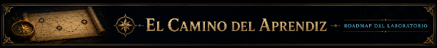

# AI Agent Quest

<p align="center">
    
</p>

> *“Bienvenidos, aprendices.*
>
> *Durante años, muchos han confundido a los agentes con magia.*
>
> *Creen que nacen de prompts grandiosos o frameworks complejos.*
>
> *Pero la verdad es más simple… y más peligrosa.*
>
> *Un agente es voluntad.*
>
> *La capacidad de percibir, razonar y actuar sobre el mundo.*
>
> *En este laboratorio no aprenderán únicamente a utilizar herramientas.*
>
> *Aprenderán a comprenderlas.*
>
> *Forjarán memoria donde antes había olvido.*
>
> *Conectarán herramientas donde antes solo existía lenguaje.*
>
> *Y, paso a paso, darán forma a sistemas capaces de actuar más allá de una simple conversación.*
>
> *Cada Quest representa un fragmento del conocimiento del Laboratorio Arkanum.*
>
> *Algunos de ustedes crearán simples ecos.*
>
> *Otros… se convertirán en Arquitectos de Agentes.”*
>
> — **Zhyréon**, Director del Laboratorio Arkanum

AI Agent Quest es una travesía práctica para aprender cómo funcionan realmente los agentes IA modernos.

A lo largo de cada Quest, los aprendices construirán agentes desde cero: aprenderán a otorgar memoria, conectar herramientas, consultar conocimiento, ejecutar workflows y comunicarse mediante protocolos modernos como MCP.

Aquí no buscamos únicamente usar frameworks.  

Buscamos comprender el mecanismo detrás de ellos.

---

<p align="center">
    
</p>


AI Agent Quest está dividido en 4 grandes actos.

Cada acto representa una nueva etapa en la evolución del agente:

desde una simple invocación hasta sistemas capaces de actuar, razonar y colaborar.

```text
Prompt → Memoria → Herramientas → Conocimiento → Protocolos → Sistemas
```

---

### ACTO I — Fundamentos del Agente

> *“Antes de construir inteligencia, debes comprender conversación, contexto y memoria.”*
> — Zhyréon

En este acto aprenderás los fundamentos detrás de los agentes modernos:

- prompts
- contexto
- memoria
- roles
- instrucciones del sistema
- consumo de tokens

Aquí construiremos el núcleo conversacional del agente.

### ACTO II — Capacidad de Acción

> *“Una voz inteligente es útil.*
> *Un agente capaz de actuar cambia el mundo.”*
> — Zhyréon

El agente aprenderá a utilizar herramientas y operar sobre el mundo exterior.

⚠️ Este acto se encuentra en desarrollo.

### ACTO III — Inteligencia Extendida

> *“La memoria individual es limitada.*
> *Los grandes arquitectos construyen bibliotecas.”*
> — Zhyréon

Exploraremos recuperación de conocimiento, workflows y protocolos modernos para agentes.

⚠️ Este acto se encuentra en desarrollo.

### ACTO IV — Arquitectura de Agentes

> *“Cuando múltiples inteligencias cooperan, nace una arquitectura.”*
> — Zhyréon

Construiremos sistemas multi-agente, evaluación y proyectos finales.

⚠️ Este acto se encuentra en desarrollo.

---

Cada Quest introduce:

- un concepto clave
- un laboratorio práctico
- un reto técnico
- una nueva habilidad para el agente

---

## Filosofía del Laboratorio

Primero entendemos los fundamentos.  

Luego utilizamos frameworks.

Los agentes no son magia.  

Son sistemas.

---

<p align="center">
    
</p>

El laboratorio incluye una biblioteca de referencia llamada:

```text
docs/
```

El Códex contiene explicaciones sobre:
- terminal
- Python
- LLMs
- agentes
- tokens
- memoria
- contexto conversacional

Puedes consultarlo en cualquier momento durante el laboratorio y usarlo para ampliar tus conocimientos o consultar cosas que te llamen la atención. Se incluyen referencias a las entradas relevantes en los README de cada quest.

```text
docs/README.md
```

## Requisitos previos

Antes de comenzar necesitarás:

- Python 3.12+
- Git
- uv

---

## Instalación de uv

`uv` es el gestor de paquetes y entornos utilizado por el laboratorio.
Nos permite instalar y ejecutar todas las dependencias de forma simple y reproducible.

### Windows (PowerShell)

```powershell
powershell -ExecutionPolicy ByPass -c "irm https://astral.sh/uv/install.ps1 | iex"
```

### macOS / Linux

```bash
curl -LsSf https://astral.sh/uv/install.sh | sh
```

---

## Verificar instalación

```bash
uv --version
```

Si todo salió correctamente, ya puedes continuar con la instalación del laboratorio.

---

## Inicio Rápido

### 1. Clonar el repositorio

```bash
git clone <repo-url>
cd ai-agent-quest
```

### 2. Instalar dependencias

```bash
uv sync
```

### 3. Configurar variables de entorno

Crea un archivo `.env` a partir del ejemplo `.env.example` 
```bash
cp .env.example .env
```

Agrega tu API key:

```env
GEMINI_API_KEY=your_api_key
```

### 4. Iniciar el primer Quest

Cada Quest contiene:

- teoría breve
- objetivos
- instrucciones paso a paso
- starter code
- validaciones
- solución final

Comienza abriendo el README del primer Quest:

```text
quests/quest_01_first_agent/README.md
```

o desde terminal:

```bash
code quests/quest_01_first_agent/README.md
```

Sigue las instrucciones del Quest y trabaja sobre:

```text
starter/main.py
```

Cuando termines, puedes validar tu solución ejecutando:

```bash
uv run python -m quests.quest_01_first_agent.check
```

---

## Opcional: Experiencia visual arcana en VSCode

Este curso fue diseñado con una pequeña capa estética inspirada en un laboratorio arcano, solo por diversión y ambientación ✨

Para una mejor experiencia visual, se recomienda utilizar VSCode e instalar:

- [Material Icon Theme](https://marketplace.visualstudio.com/items?itemName=PKief.material-icon-theme)

El repositorio ya incluye un archivo de configuración de VSCode con asociaciones de íconos personalizadas para las quests y carpetas del laboratorio.

Una vez instalado el plugin, la ambientación visual debería aplicarse automáticamente al abrir el proyecto. 

Esto es completamente opcional, pero ayuda a que la academia se sienta un poco más viva ✨