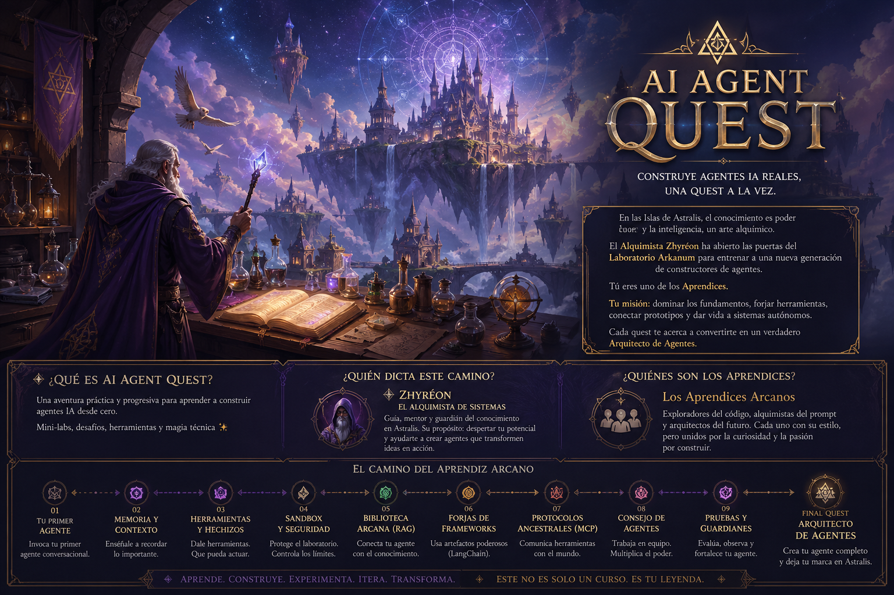
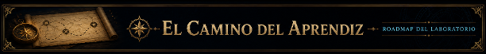
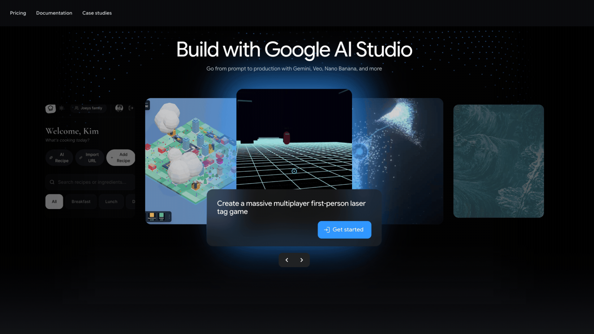

# AI Agent Quest

<p align="center">
    
</p>

> *“Bienvenidos, aprendices.*
>
> *Durante años, muchos han confundido a los agentes con magia.*
>
> *Creen que nacen de prompts grandiosos o frameworks complejos.*
>
> *Pero la verdad es más simple… y más peligrosa.*
>
> *Un agente es voluntad.*
>
> *La capacidad de percibir, razonar y actuar sobre el mundo.*
>
> *En este laboratorio no aprenderán únicamente a utilizar herramientas.*
>
> *Aprenderán a comprenderlas.*
>
> *Forjarán memoria donde antes había olvido.*
>
> *Conectarán herramientas donde antes solo existía lenguaje.*
>
> *Y, paso a paso, darán forma a sistemas capaces de actuar más allá de una simple conversación.*
>
> *Cada Quest representa un fragmento del conocimiento del Laboratorio Arkanum.*
>
> *Algunos de ustedes crearán simples ecos.*
>
> *Otros… se convertirán en Arquitectos de Agentes.”*
>
> — **Zhyréon**, Director del Laboratorio Arkanum

AI Agent Quest es una travesía práctica para aprender cómo funcionan realmente los agentes IA modernos.

A lo largo de cada Quest, los aprendices construirán agentes desde cero: aprenderán a otorgar memoria, conectar herramientas, consultar conocimiento, ejecutar workflows y comunicarse mediante protocolos modernos como MCP.

Aquí no buscamos únicamente usar frameworks.  

Buscamos comprender el mecanismo detrás de ellos.

---

<p align="center">
    
</p>


AI Agent Quest está dividido en 4 grandes actos.

Cada acto representa una nueva etapa en la evolución del agente:

desde una simple invocación hasta sistemas capaces de actuar, razonar y colaborar.

```text
Prompt → Memoria → Herramientas → Conocimiento → Protocolos → Sistemas
```

---

### ACTO I — Fundamentos del Agente

> *“Antes de construir inteligencia, debes comprender conversación, contexto y voluntad.”*
> — Zhyréon

En este acto aprenderás los fundamentos detrás de los modelos conversacionales modernos:

- prompts
- temperatura
- contexto
- roles
- instrucciones del sistema
- consumo de tokens
- debugging básico
- estructura de interacción con LLMs

Aquí construiremos la primera voz del agente.

### ACTO II — Capacidad de Acción

> *“Una voz inteligente puede responder preguntas.  
> Un agente encarnado puede transformar el mundo.”*  
> — Zhyréon

El aprendiz abandona la teoría.

En este acto construiremos los primeros componentes reales de un sistema agéntico:

- working directories
- guardrails
- tool schemas
- function calling
- function dispatch
- tool execution
- agent loops iterativos
- observaciones estructuradas
- verbose mode
- ciclos de razonamiento y manifestación

Al finalizar este acto, el agente podrá:

- explorar archivos
- leer contenido
- escribir programas
- ejecutar código
- observar resultados
- iterar sobre problemas
- corregir errores utilizando tools reales

### ACTO III — Inteligencia Extendida

> *“La memoria individual es limitada.*
> *Los grandes arquitectos construyen bibliotecas.”*
> — Zhyréon

Exploraremos recuperación de conocimiento, workflows y protocolos modernos para agentes.

⚠️ Este acto se encuentra en desarrollo.

### ACTO IV — Arquitectura de Agentes

> *“Cuando múltiples inteligencias cooperan, nace una arquitectura.”*
> — Zhyréon

Construiremos sistemas multi-agente, evaluación y proyectos finales.

⚠️ Este acto se encuentra en desarrollo.

---

Cada Quest introduce:

- un concepto clave
- un laboratorio práctico
- un reto técnico
- una nueva habilidad para el agente

---

## Filosofía del Laboratorio

Primero entendemos los fundamentos.  

Luego utilizamos frameworks.

Los agentes no son magia.  

Son sistemas.

---

<p align="center">
    
</p>

El laboratorio incluye una biblioteca de referencia llamada:

```text
docs/
```

El Códex contiene explicaciones sobre:
- terminal
- Python
- LLMs
- agentes
- tokens
- memoria
- contexto conversacional

Puedes consultarlo en cualquier momento durante el laboratorio y usarlo para ampliar tus conocimientos o consultar cosas que te llamen la atención. Se incluyen referencias a las entradas relevantes en los README de cada quest.

```text
docs/README.md
```

## Configuración inicial

Esta sección te lleva desde cero hasta tener el **dashboard arcano** abierto en tu navegador. Desde ahí el dashboard se vuelve tu guía principal: mapa de quests, instrucciones, diagnóstico, rangos y celebraciones.

### Prerrequisitos

- **Python 3.12+**
- **Git**
- **`uv`** — gestor de paquetes y entornos. Instalación oficial:

  **Windows (PowerShell):**
  ```powershell
  powershell -ExecutionPolicy ByPass -c "irm https://astral.sh/uv/install.ps1 | iex"
  ```

  **macOS / Linux:**
  ```bash
  curl -LsSf https://astral.sh/uv/install.sh | sh
  ```

  Verifica con `uv --version`.

  > Si el comando no se encuentra justo después de instalarlo, **cierra y vuelve a abrir la terminal**. El instalador agrega `uv` al `PATH` del usuario, pero las sesiones ya abiertas no lo recogen hasta reiniciarse.
  >
  > Si estás usando el terminal integrado de **VS Code**, cerrar solo el panel del terminal no basta: VS Code captura el `PATH` al iniciar y lo hereda a todos los terminales que abras dentro. Cierra la ventana entera de VS Code y vuelve a abrirla, o usa `Ctrl+Shift+P` → *Developer: Reload Window* (más rápido).

---

### 1. Clonar el repositorio

```bash
git clone <repo-url>
cd AIAgentQuest
```

### 2. Instalar dependencias

```bash
uv sync
```

Esto crea el entorno virtual en `.venv/` e instala el ejecutable `arkanum` (gracias a la entrada `[project.scripts]` declarada en `pyproject.toml`).

### 3. Activar el entorno virtual

Para que el comando `arkanum` esté disponible directamente:

**Windows (PowerShell):**
```powershell
. .\.venv\Scripts\Activate.ps1
```

> Si PowerShell rechaza el script con un error de política de ejecución, ejecuta una sola vez:
> ```powershell
> Set-ExecutionPolicy -Scope CurrentUser -ExecutionPolicy RemoteSigned
> ```

**macOS / Linux:**
```bash
source .venv/bin/activate
```

### 4. Configurar tu API key de Gemini

Crea el archivo `.env` a partir del ejemplo:

**Windows (PowerShell):** 

```
Copy-Item .env.example .env
```

**macOS / Linux:** 

```
cp .env.example .env
```

Edita `.env` y pega tu clave real (la obtienes gratis en [aistudio.google.com/app/apikey](https://aistudio.google.com/app/apikey) → *Create API key*):



```env
GEMINI_API_KEY=<TU-API-KEY>
```

> Sin comillas, sin espacios, una sola línea.

### 5. Registrar tu aprendiz y abrir el dashboard

```bash
arkanum init
```

El wizard te pedirá tu nombre, validará tu `.env`, hará ping a Gemini y abrirá el **dashboard arcano** en tu navegador. Esto también crea tu base SQLite local de progreso (`.quest_progress.db`, ya está en `.gitignore`).

Si el navegador no se abre solo, visita: [http://127.0.0.1:8765](http://127.0.0.1:8765)

---

## Tu travesía continúa en el dashboard

A partir de aquí el dashboard es tu mapa, tu bitácora y tu mentor. Explora sus pestañas:

- **Perfil** — tu rango, nivel, XP, pills de logros y panel de diagnóstico continuo del setup.
- **Mapa** — los 4 actos y las 8 quests con su estado (actual / sellada / bloqueada).
- **Rangos** — colección de rangos desbloqueados, uno por cada quest completada.
- **Hitos** — pergaminos que se sellan al cerrar cada acto.
- **Setup** — diagnóstico de los 9 prerrequisitos en tiempo real. Si algo falla, te muestra debajo el comando exacto para arreglarlo.
- **Live Agent** — visualización en vivo del agent loop (a partir del Acto II).
- **Códex** — biblioteca de referencia con explicaciones de conceptos.

Cada quest tiene su propio pergamino con la teoría, las pistas y un botón **"⚜ Empezar ahora"** al final. Al pulsarlo arranca el cronómetro y aparecen los dos pasos concretos: abrir el archivo `starter/main.py` en tu editor y, al terminar, validar con `arkanum check N` desde la terminal. Cuando el check pasa, el dashboard sella la quest automáticamente y abre la página de celebración.

Atajos del CLI que probablemente uses todo el tiempo:

```bash
arkanum current            # quest en la que estás
arkanum progress           # tabla de tu avance
arkanum doctor             # diagnóstico completo (incluye ping real a Gemini)
arkanum dashboard status   # PID y puerto del server
arkanum dashboard stop     # detener el dashboard
arkanum dashboard start    # volver a levantarlo (y abrir el navegador)
```

---

## Si algo no funciona

El laboratorio incluye dos herramientas de diagnóstico que te dicen exactamente qué arreglar:

### 1. Pestaña **Setup** del dashboard

Visita [http://127.0.0.1:8765/setup](http://127.0.0.1:8765/setup). Verás los 9 checks del laboratorio (Python, uv, dependencias, `.env`, API key, BD, dashboard, workspace) con su estado en tiempo real. Cuando algo falla, aparece debajo una sección **"Cómo arreglar"** con el comando exacto para Windows y macOS / Linux. El panel se refresca solo cada 30 segundos.

### 2. Comando `arkanum doctor`

```bash
arkanum doctor
```

Misma información en la terminal, en formato tabla, y con un ping real a Gemini para verificar que tu clave funciona.

### Problemas comunes

- **`arkanum` no se encuentra** → no activaste el venv. Vuelve al paso 3 o usa `uv run arkanum ...`.
- **`uv` no se encuentra después de instalarlo** → cierra y vuelve a abrir la terminal (el `PATH` del usuario se actualiza, pero las sesiones abiertas no lo recogen). Si estás en el terminal integrado de **VS Code**, cierra la ventana entera o usa `Ctrl+Shift+P` → *Developer: Reload Window*; cerrar solo el panel del terminal no es suficiente.
- **El dashboard no responde** → `arkanum dashboard status` para ver si está vivo; si no, `arkanum dashboard start`.
- **API key inválida** → revisa que la clave en `.env` no tenga comillas, espacios ni saltos de línea, y que siga activa en [aistudio.google.com](https://aistudio.google.com).

---

## Opcional: Experiencia visual arcana en VSCode

Este curso fue diseñado con una pequeña capa estética inspirada en un laboratorio arcano, solo por diversión y ambientación ✨

Para una mejor experiencia visual, se recomienda utilizar VSCode e instalar:

- [Material Icon Theme](https://marketplace.visualstudio.com/items?itemName=PKief.material-icon-theme)

El repositorio ya incluye un archivo de configuración de VSCode con asociaciones de íconos personalizadas para las quests y carpetas del laboratorio.

Una vez instalado el plugin, la ambientación visual debería aplicarse automáticamente al abrir el proyecto. 

Esto es completamente opcional, pero ayuda a que la academia se sienta un poco más viva ✨
