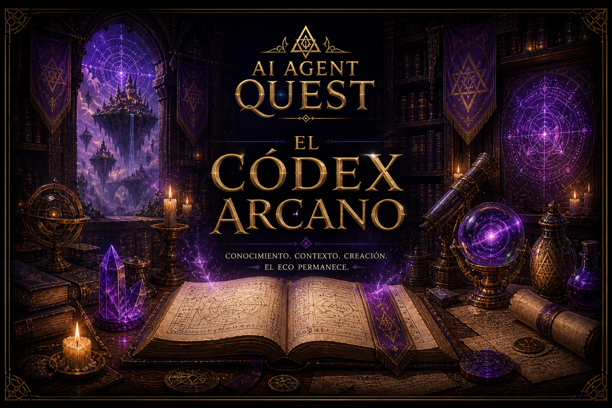

# El Códex Arcano

    

> “Los Quests enseñan el camino.
> El Códex preserva la sabiduría.”
>
> — Zhyréon

No todo conocimiento pertenece a un Quest.

Algunas verdades son demasiado antiguas, demasiado profundas o demasiado peligrosas para enseñarse durante una simple invocación.

Por eso existe este códice.

Aquí descansan fragmentos del conocimiento del Laboratorio Arkanum:
- principios sobre agentes
- notas sobre modelos de lenguaje
- estructuras conversacionales
- herramientas del laboratorio
- fundamentos de terminal y Python
- observaciones sobre memoria, contexto y razonamiento

Los Quests enseñan a construir.
El Códice a comprender.

---

# Índice del Códex

## Terminal

Fundamentos para navegar e interactuar con herramientas desde consola.

- [cli basics](./terminal/cli_basics.md)
- [help flags](./terminal/help_flags.md)
- [`--verbose` mode](./terminal/verbose_mode.md)

---

## CLI del laboratorio

Referencia de los comandos `arkanum *`: para qué sirve cada uno, cuándo invocarlos y qué efecto tienen en el cronómetro, la BD y el dashboard.

- [comandos del CLI](./cli/commands.md)

---

## Python

Herramientas y conceptos utilizados durante el laboratorio.

- [`argparse.md`](./python/argparse.md)
- [`__main__` function](./python/main_function.md)
- [variables de entorno](./python/environment_variables.md)

---

## Modelos y Agentes

Conceptos fundamentales sobre LLMs y sistemas basados en agentes.

- [agents](./agents/agents.md)
- [`Content` y `Parts`](./agents/content_and_parts.md)
- [definir herramientas para agentes](./agents/tool_schemas.md)
- [expedición de funciones](./agents/function_dispatch.md)
- [guardrails](./agents/guardrails.md)
- [manejo de errores](./agents/error_handling.md)
- [prompts](./llms/prompts.md)
- [roles y mensajes](./llms/roles_and_messages.md)
- [prompts de sistema](./LLMs/system_prompts.md)
- [temperatura](./LLMs/temperature.md)
- [tokens](./llms/tokens.md)

---

> *“Toda conversación deja un eco.*
>
> *Toda herramienta deja una marca.*
>
> *Y todo arquitecto deja conocimiento para quienes caminan después.”*