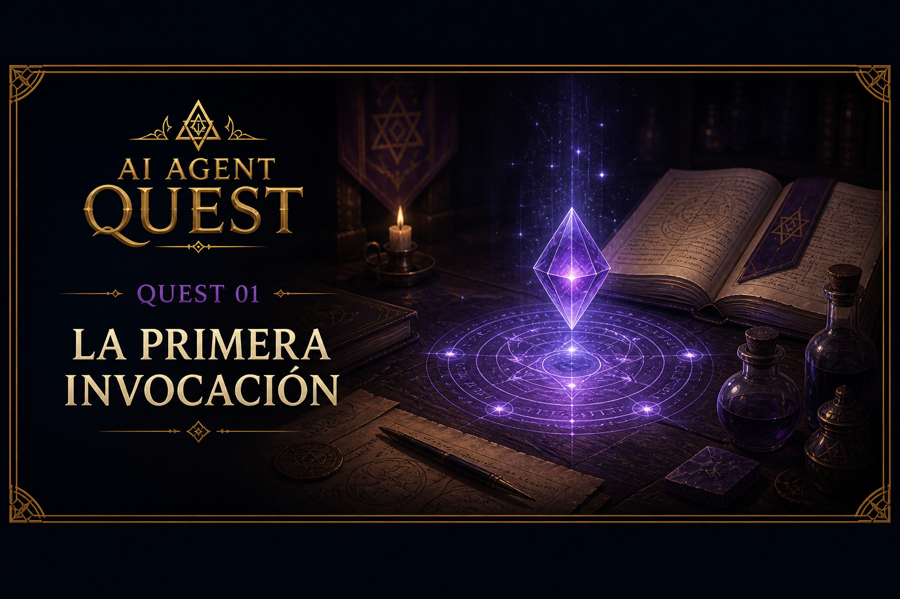

# Quest 01 — La Primera Invocación

<p align="center">
    
</p>

> “Antes de otorgar memoria, herramientas o conocimiento, primero debes aprender a invocar una voz.”
>
> — Zhyréon

## Información del Quest

| Dificultad | Tiempo estimado |
|---|---|
| 🟢 Fácil | 5–15 mins |

## Objetivo

En este Quest vas a enviar tu primer mensaje a Gemini desde Python y mostrar la respuesta en la terminal.

Antes de construir memoria, herramientas o [agentes](../../docs/agents/agents.md) que actúen sobre archivos, necesitamos entender la pieza más básica del sistema:

> tu programa envía un texto a un modelo, y el modelo devuelve una respuesta.

## Conceptos importantes
### LLMs

Los [Large Language Models (LLMs)](../../docs/LLMs/llms.md) son la tecnología detrás de herramientas modernas como:

- ChatGPT
- Claude
- Cursor
- Gemini

Para este laboratorio puedes pensar en un LLM como un generador inteligente de texto:

1. tú envías un mensaje (prompt)
2. el modelo procesa el mensaje
3. el modelo devuelve una respuesta que considera responde a tu mensaje

Durante este curso utilizaremos la API de Gemini para construir nuestro agente (porque tiene un free tier y es muy fácil de usar).

---

### Tokens

Los modelos no “leen texto” exactamente como nosotros.

Procesan unidades llamadas [**tokens**](../../docs/LLMs/tokens.md).

Un token suele equivaler aproximadamente a:
- una palabra corta
- parte de una palabra larga
- o ~4 caracteres de texto

Los tokens funcionan como la “moneda” de los modelos:
mientras más texto envías y recibes, más tokens consumes.

Por ahora nuestro uso será pequeño, pero más adelante aprenderemos por qué esto es importante para construir agentes eficientes.

---

### Variables de entorno

Para usar Gemini necesitas una API key.

La API key es una llave secreta que autentica tus peticiones contra la API.

⚠️ Nunca deberías escribir una API key directamente en el código.

En su lugar, la guardaremos en un archivo `.env`. (Puedes consultar más información al respecto [aquí](../../docs/python/environment_variables.md)).

---

## Tu misión

### 1. Crear una API key

Ingresa a [Google AI Studio](https://aistudio.google.com/welcome?utm_source=google&utm_medium=cpc&utm_campaign=Cloud-SS-DR-AIS-FY26-global-gsem-1713578&utm_content=text-ad&utm_term=KW_google%20ai%20studio&gad_source=1&gad_campaignid=23417416052&gclid=Cj0KCQjw2MbPBhCSARIsAP3jP9wcqvzk345vPCvJQb_KIAusbqEMljLG6gQ-NeXDi2gXiQZMI0-biQMaAm2HEALw_wcB) y genera una nueva API key.

Guárdala en un archivo `.env` en la raíz del proyecto:

```env
GEMINI_API_KEY='tu_api_key'
```

---

### 2. Ignorar el archivo `.env`

Verifica que `.env` exista en tu `.gitignore`

Nunca debemos subir:
- API keys
- contraseñas
- secretos

a GitHub (a ningún repositorio en general).

---

### 3. Completar el starter

Abre:

```text
quests/quest_01_first_agent/starter/main.py
```

En este Quest aprenderás a:

- cargar variables de entorno
- crear un cliente de Gemini
- enviar un prompt
- imprimir la respuesta del modelo

Los `TODO`s están organizados paso a paso.

---

## Qué construirás

Al finalizar tendrás un pequeño programa capaz de:

1. conectarse a Gemini
2. enviar un prompt
3. imprimir la respuesta en consola

Por ejemplo:

```text
🧙 Zhyréon: Respóndeme oh modelo inteligente ¿Qué eres capaz de hacer?...

🤖 Gemini:
Los agentes IA son sistemas capaces de...
```

---

## Ejecutar el Quest

Desde la raíz del proyecto:

```bash
uv run python -m quests.quest_01_first_agent.starter.main
```

---

## Criterio de éxito

Cuando termines, ejecuta el siguiente comando para validar:

```bash
uv run python -m quests.quest_01_first_agent.check
```

Mini nota: este check consume una llamada real a Gemini porque ejecuta el starter. Tenlo presente y no lo corras hasta terminar todos los TODOs para evitar pasarte de los límites.

---
