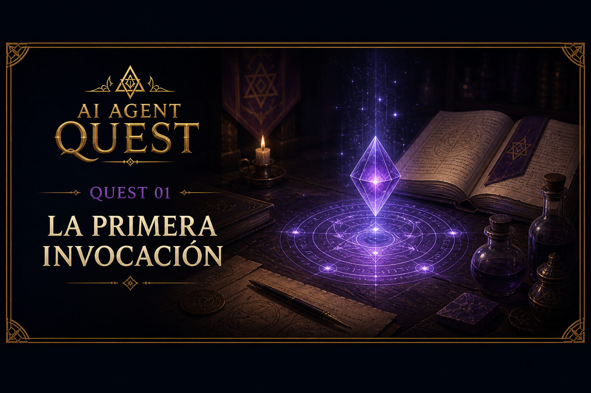

# Quest 01 — La Primera Invocación

<p align="center">
    
</p>

## 🎭 Lore

> *“Antes de otorgar memoria, herramientas o conocimiento, primero debes aprender a invocar una voz.”*
>
> — Zhyréon

## Información del Quest

| Acto | Dificultad | Tiempo estimado |
|---|---|---|
| I — Fundamentos del Agente | 🟢 Fácil | 5–15 mins |

---

## 🎯 Objetivo

Enviar tu primer mensaje a Gemini desde Python y mostrar la respuesta en la terminal.

Antes de construir memoria, herramientas o [agentes](../../docs/agents/agents.md) que actúen sobre archivos, necesitas entender la pieza más básica del sistema:

> tu programa envía un texto a un modelo, y el modelo devuelve una respuesta.

---

## 📚 Conceptos clave

### LLMs

Los [Large Language Models (LLMs)](../../docs/LLMs/llms.md) son la tecnología detrás de herramientas como ChatGPT, Claude, Cursor o Gemini.

Para este laboratorio puedes pensar en un LLM como un generador inteligente de texto:

1. tú envías un mensaje (prompt)
2. el modelo procesa el mensaje
3. el modelo devuelve una respuesta

En este curso usaremos la API de Gemini (tiene free tier y es fácil de usar).

### Tokens

Los modelos no “leen texto” como nosotros. Procesan unidades llamadas [**tokens**](../../docs/LLMs/tokens.md).

Un token equivale aproximadamente a:
- una palabra corta
- parte de una palabra larga
- o ~4 caracteres de texto

Los tokens son la “moneda” de los modelos: mientras más texto envías y recibes, más tokens consumes.

### Variables de entorno

Para usar Gemini necesitas una **API key**: una llave secreta que autentica tus peticiones.

⚠️ Nunca escribas una API key directamente en el código. La guardaremos en un archivo `.env` (más info [aquí](../../docs/python/environment_variables.md)).

---

## 📋 Tu misión

### 1. Crear una API key

Ingresa a [Google AI Studio](https://aistudio.google.com/) y genera una nueva API key.

Guárdala en un archivo `.env` en la raíz del proyecto:

```env
GEMINI_API_KEY='tu_api_key'
```

### 2. Ignorar el archivo `.env`

Verifica que `.env` esté en tu `.gitignore`. Nunca subas a GitHub:
- API keys
- contraseñas
- secretos

### 3. Completar el starter

Abre `quests/quest_01_first_invocation/starter/main.py` y completa los `TODO`s en orden. Aprenderás a:

- cargar variables de entorno
- crear un cliente de Gemini
- enviar un prompt
- imprimir la respuesta del modelo

---

## 💡 Pistas

Cada `TODO` del starter incluye pistas en **3 capas progresivas**:

- **Pista 1 (conceptual):** qué tienes que hacer, en palabras simples.
- **Pista 2 (técnica):** el nombre de la función o método que resuelve el paso.
- **Pista 3 (snippet):** el código casi completo, para destrabar si las anteriores no fueron suficientes.

Empieza intentando sin mirar; baja de capa solo cuando te atasques. La idea es esforzarse en entender, no en adivinar.

---

## ✅ Resultado esperado

Al finalizar tendrás un programa capaz de:

1. conectarse a Gemini
2. enviar un prompt
3. imprimir la respuesta en consola

Por ejemplo:

```text
🧙 Zhyréon: Respóndeme oh modelo inteligente ¿Qué eres capaz de hacer?...

🤖 Gemini:
Los agentes IA son sistemas capaces de...
```

---

## 🔗 Referencias

- [LLMs](../../docs/LLMs/llms.md)
- [Tokens](../../docs/LLMs/tokens.md)
- [Variables de entorno en Python](../../docs/python/environment_variables.md)
- [Agentes](../../docs/agents/agents.md)
