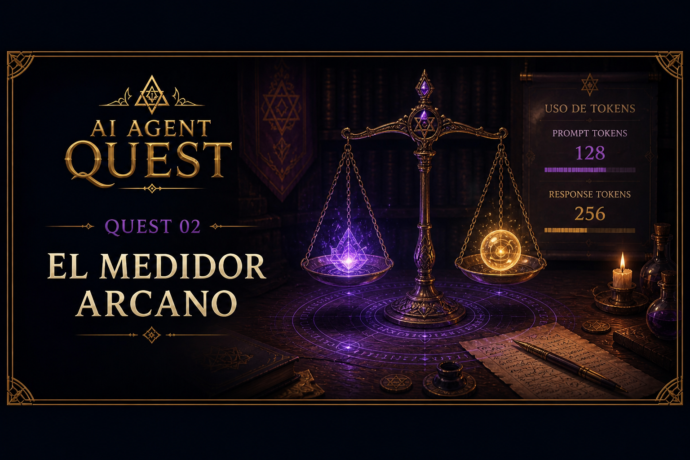

# Quest 02 — El Medidor Arcano

<p align="center">
    
</p>

> *“Toda invocación consume energía.*
> *Los aprendices imprudentes agotan sus recursos antes de comprender el costo de sus palabras.”*
>
> — Zhyréon

## Información del Quest

|Acto| Dificultad | Tiempo estimado |
|---|---|---|
| I - Fundamentos del Agente | 🟢 Fácil | 5–15 mins |

## Metadata de Tokens

Cuando trabajamos con modelos de lenguaje, es importante entender cuántos tokens consumimos.

Los tokens son las unidades que utiliza el modelo para procesar texto.

Mientras más contexto enviamos y más texto genera el modelo:
- más tokens consumimos
- más costo tiene la invocación
- más cerca estamos de los límites de uso

(Puedes consultar más [aquí](../../docs/LLMs/tokens.md))

---

## Usage Metadata

La respuesta de Gemini incluye una propiedad llamada:

```python
response.usage_metadata
```

Esta contiene información útil sobre la invocación.

En este Quest utilizaremos:

```python
prompt_token_count
```

Cantidad de tokens enviados al modelo.

y:

```python
candidates_token_count
```

Cantidad de tokens generados en la respuesta.

---

## Continuando el laboratorio

A partir de este Quest, el agente evolucionará progresivamente.

Cada nuevo Quest expandirá el código construido anteriormente:
- agregando memoria
- herramientas
- contexto
- workflows
- capacidades autónomas

No estás construyendo ejercicios separados.

Estás construyendo un agente.

---

## Tu misión

Actualiza el starter para:

1. mostrar el prompt enviado
2. imprimir los tokens consumidos
3. validar que `usage_metadata` no sea `None`

---

## Resultado esperado

```text
🧑 User prompt:
¿Qué es un agente IA?

Prompt tokens: 18
Response tokens: 96

🤖 Gemini:
Un agente IA es...
```

---

## Ejecutar el Quest

```bash
uv run python -m quests.quest_02_token_metadata.starter.main
```

---

## Criterio de éxito

Completaste el Quest si:

- puedes ver los tokens consumidos
- el programa valida usage_metadata
- la respuesta sigue funcionando correctamente

---

> *“Un buen arquitecto no solo observa las respuestas.*
> *También comprende el costo de obtenerlas.”*