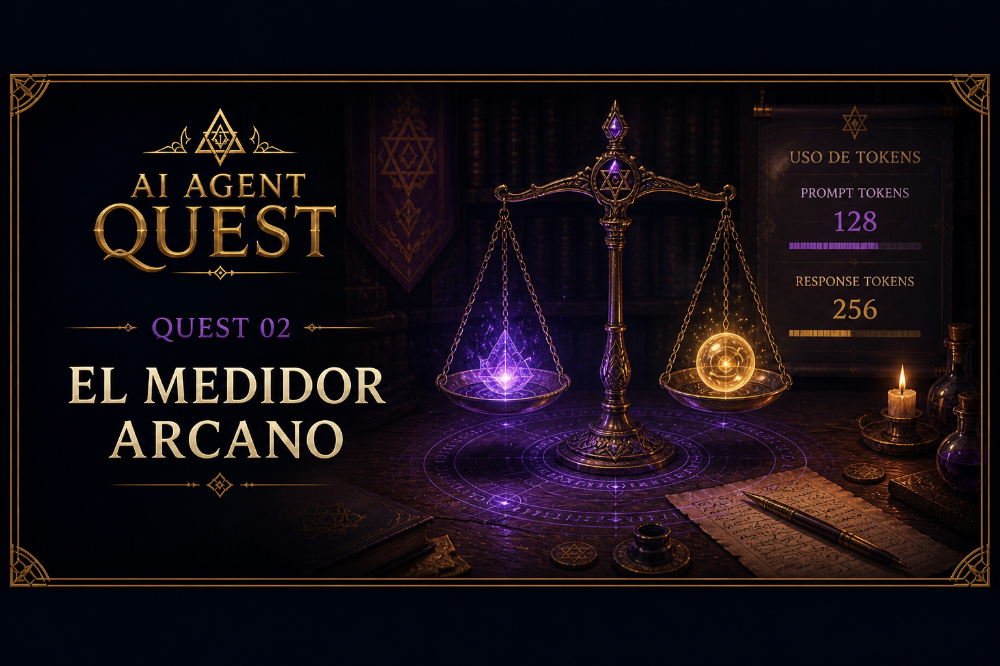

# Quest 02 — El Medidor Arcano

<p align="center">
    
</p>

## 🎭 Lore

> *“Toda invocación consume energía.*
> *Los aprendices imprudentes agotan sus recursos antes de comprender el costo de sus palabras.”*
>
> — Zhyréon

## Información del Quest

| Acto | Dificultad | Tiempo estimado |
|---|---|---|
| I — Fundamentos del Agente | 🟢 Fácil | 5–15 mins |

---

## 🎯 Objetivo

Inspeccionar la metadata de uso (`usage_metadata`) que Gemini devuelve junto con cada respuesta, para entender cuántos tokens consume una invocación.

A partir de este Quest el agente evoluciona progresivamente: no construyes ejercicios separados, **construyes un agente** que va sumando capacidades (memoria, herramientas, contexto, workflows, autonomía).

---

## 📚 Conceptos clave

### Tokens

Cuando trabajamos con modelos de lenguaje, es importante entender cuántos tokens consumimos. Los tokens son las unidades que utiliza el modelo para procesar texto.

Mientras más contexto enviamos y más texto genera el modelo:
- más tokens consumimos
- más costo tiene la invocación
- más cerca estamos de los límites de uso

(Más info [aquí](../../docs/LLMs/tokens.md)).

### Usage Metadata

La respuesta de Gemini incluye una propiedad llamada:

```python
response.usage_metadata
```

En este Quest usaremos dos campos de esa metadata:

```python
prompt_token_count       # tokens enviados al modelo
candidates_token_count   # tokens generados en la respuesta
```

---

## 📋 Tu misión

Actualiza el starter para:

1. mostrar el prompt enviado
2. imprimir los tokens consumidos
3. validar que `usage_metadata` no sea `None`

---

## ✅ Resultado esperado

```text
🧑 User prompt:
¿Qué es un agente IA?

Prompt tokens: 18
Response tokens: 96

🤖 Gemini:
Un agente IA es...
```

---

## 🔗 Referencias

- [Tokens](../../docs/LLMs/tokens.md)

---

> *“Un buen arquitecto no solo observa las respuestas.*
> *También comprende el costo de obtenerlas.”*
