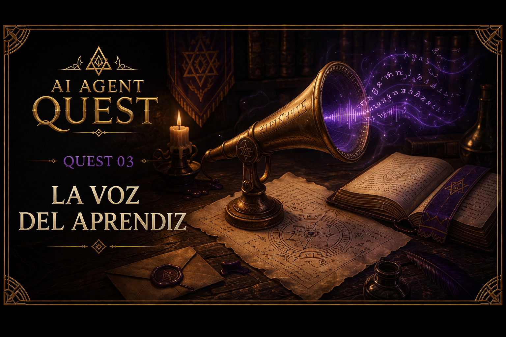

# Quest 03 — La Voz del Aprendiz

<p align="center">
    
</p>

> *“Un agente que solo repite instrucciones fijas no escucha realmente.*
>
> *La verdadera conversación comienza cuando el aprendiz puede hablar.”*
>
> — Zhyréon

## Información del Quest

| Dificultad | Tiempo estimado |
|---|---|
| 🟢 Fácil | 10–15 mins |

---

## Objetivo

Hasta ahora nuestro agente utilizaba un prompt hardcoded dentro del código.

Eso funciona para pruebas simples, pero no es muy útil:
cada vez que queremos cambiar el prompt, tenemos que modificar el archivo manualmente.

En este Quest aprenderás a recibir input desde la terminal y a construir mensajes estructurados usando los tipos de Gemini.

---

## Qué aprenderás

- usar `argparse`
- recibir argumentos desde consola
- construir mensajes usando `types.Content`
- trabajar con roles (`user`)
- enviar listas de mensajes al modelo

---

## Argumentos por CLI

Usaremos el módulo estándar de Python `argparse` para pasar prompts por consola directamente, de modo que el usuario pueda escribir sus propmts al invocar el modelo.


### Introducción a `argparse`

Python incluye un módulo estándar llamado:

```python
import argparse
```

Este módulo permite construir aplicaciones de terminal capaces de recibir argumentos desde consola.

Por ejemplo:

```bash
uv run python -m quests.quest_03_user_input.starter.main \
"¿Qué es un agente IA?"
```

Aquí el texto:

```text
"¿Qué es un agente IA?"
```

será recibido por el programa como un argumento.

#### 1. Crear un parser

Primero creamos un parser:

```python
parser = argparse.ArgumentParser(
    description="Chatbot"
)
```

El parser será el encargado de interpretar los argumentos enviados desde terminal.

#### 2. Agregar argumentos

Luego definimos qué argumentos esperamos recibir:

```python
parser.add_argument(
    "user_prompt",
    type=str,
    help="Prompt del usuario"
)
```

En este caso:
- `user_prompt` será obligatorio
- el valor será un string
- `help` define el mensaje de ayuda

#### 3. Parsear argumentos

Finalmente:

```python
args = parser.parse_args()
```

Esto procesa los argumentos enviados desde consola.

Luego podemos acceder al prompt usando:

```python
args.user_prompt
```

(Si te interesa saber más sobre `argparse` puedes consultar la [entrada del códex](../../docs/python/argparse.md) o la [documentación oficial](https://docs.python.org/es/3/library/argparse.html))

---

## Ejemplo completo

```python
import argparse

parser = argparse.ArgumentParser(
    description="Chatbot"
)

parser.add_argument(
    "user_prompt",
    type=str,
    help="Prompt del usuario"
)

args = parser.parse_args()

print(args.user_prompt)
```

---

## Validación automática

Una ventaja importante de `argparse`
es que Python valida automáticamente los argumentos.

Por ejemplo, si ejecutas el programa sin enviar un prompt:

```bash
uv run python -m quests.quest_03_user_input.starter.main
```

`argparse` mostrará un error explicando qué argumento falta.


---

## Roles y mensajes

Hasta ahora enviábamos un string simple:

```python
contents="¿Qué es un agente de IA?"
```

Eso funciona para prompts sencillos. 
Pero los agentes modernos trabajan con conversaciones estructuradas.

En lugar de recibir únicamente texto, el modelo recibe una lista de mensajes:

```text
user → mensaje del usuario

model → respuesta del modelo

user → nueva pregunta
```

Cada mensaje tiene:

- un rol (`user`, `model`, etc.)
- contenido
- partes (`parts`)

Por eso Gemini utiliza estructuras como:

```python
types.Content
```

y:

```python
types.Part
```

---

## Estructura de un mensaje

Un mensaje básico se ve así:

```python
types.Content(
    role="user",
    parts=[
        types.Part(
            text="¿Qué es un agente IA?"
        )
    ]
)
```

---

## ¿Por qué existe `parts`?

Porque un mensaje no necesariamente contiene solo texto.

En el futuro, un mensaje podría incluir:

- imágenes
- audio
- archivos
- múltiples fragmentos
- contenido multimodal

Por eso incluso un mensaje simple usa una lista de `parts`.

---

## Lista de mensajes

Finalmente, el modelo recibe una conversación completa:

```python
messages = [
    types.Content(
        role="user",
        parts=[
            types.Part(text=args.user_prompt)
        ]
    )
]
```

Y luego:

```python
response = client.models.generate_content(
    model="gemini-2.5-flash",
    contents=messages
)
```

En este Quest la conversación tiene un solo mensaje, pero más adelante construiremos historiales conversacionales completos,
permitiendo que el agente recuerde interacciones anteriores.

(Si te interesa el tema puedes consultar la [entrada del códice](../../docs/LLMs/roles_and_messages.md))

---

## Tu misión

Continúa trabajando sobre el agente construido en el Quest 02.

### Deberás:

1. reemplazar el prompt hardcoded usando `argparse`
2. importar `types` desde `google.genai`
3. crear una lista de mensajes
4. enviar `messages` en lugar de un string simple
5. mantener funcionando el medidor de tokens del Quest 02

---

## Resultado esperado

```text
🧑 User prompt:
¿Por qué es importante la memoria en un agente IA?

Prompt tokens: 21
Response tokens: 97

🤖 Gemini:
La memoria permite que un agente mantenga contexto...
```

---

## Ejecutar el Quest

Desde la raíz del proyecto:

```bash
uv run python -m quests.quest_03_user_input.starter.main "¿Qué es un agente IA?"
```

---

## Criterio de éxito

Completaste el Quest si:

- el prompt se recibe desde consola
- el modelo responde correctamente
- los tokens siguen mostrándose
- `contents` recibe una lista de mensajes
