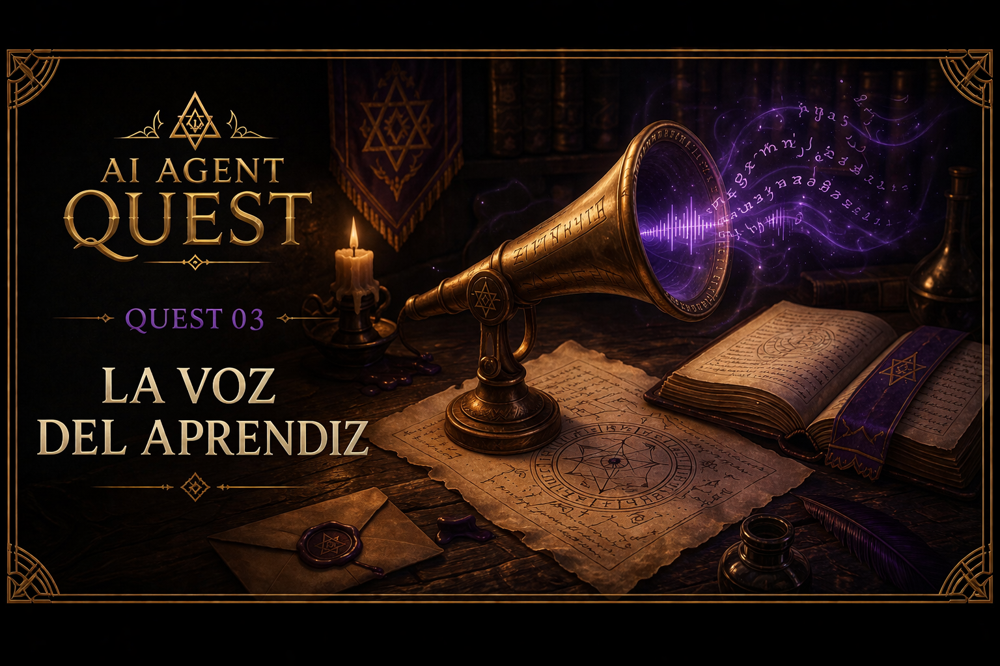

# Quest 03 — La Voz del Aprendiz

<p align="center">
    
</p>

## 🎭 Lore

> *“Un agente que solo repite instrucciones fijas no escucha realmente.*
>
> *La verdadera conversación comienza cuando el aprendiz puede hablar.”*
>
> — Zhyréon

## Información del Quest

| Acto | Dificultad | Tiempo estimado |
|---|---|---|
| I — Fundamentos del Agente | 🟢 Fácil | 10–15 mins |

---

## 🎯 Objetivo

Reemplazar el prompt hardcoded por uno que llega desde la terminal, y enviarlo al modelo como un **mensaje estructurado** usando los tipos de Gemini.

Hasta ahora nuestro agente usaba un prompt fijo dentro del código. Eso funciona para pruebas simples, pero no es útil: cada cambio de prompt requería editar el archivo.

---

## 📚 Conceptos clave

### Qué aprenderás

- usar `argparse`
- recibir argumentos desde consola
- construir mensajes usando `types.Content`
- trabajar con roles (`user`)
- enviar listas de mensajes al modelo

### `argparse` — argumentos por CLI

Python incluye un módulo estándar:

```python
import argparse
```

Permite construir aplicaciones de terminal que reciben argumentos desde consola.

Por ejemplo:

```bash
arkanum run 3 "¿Qué es un agente IA?"
```

(equivalente legacy: `uv run python -m quests.quest_03_apprentice_voice.starter.main "¿Qué es un agente IA?"`)

El texto `"¿Qué es un agente IA?"` será recibido por el programa como argumento.

#### 1. Crear un parser

```python
parser = argparse.ArgumentParser(
    description="Chatbot"
)
```

#### 2. Agregar argumentos

```python
parser.add_argument(
    "user_prompt",
    type=str,
    help="Prompt del usuario"
)
```

- `user_prompt` será obligatorio
- el valor será un string
- `help` define el mensaje de ayuda

#### 3. Parsear argumentos

```python
args = parser.parse_args()
```

Luego accedes al prompt con `args.user_prompt`.

(Más info en la [entrada del códex](../../docs/python/argparse.md) o la [documentación oficial](https://docs.python.org/es/3/library/argparse.html)).

#### Validación automática

Si ejecutas el programa sin enviar un prompt:

```bash
arkanum run 3
```

`argparse` mostrará un error explicando qué argumento falta.

### Ejemplo completo de `argparse`

```python
import argparse

parser = argparse.ArgumentParser(
    description="Chatbot"
)

parser.add_argument(
    "user_prompt",
    type=str,
    help="Prompt del usuario"
)

args = parser.parse_args()

print(args.user_prompt)
```

### Roles y mensajes

Hasta ahora enviábamos un string simple:

```python
contents="¿Qué es un agente de IA?"
```

Eso funciona para prompts sencillos. Pero los agentes modernos trabajan con conversaciones estructuradas: el modelo recibe una **lista de mensajes**, donde cada mensaje tiene:

- un rol (`user`, `model`, etc.)
- contenido
- partes (`parts`)

```text
user → mensaje del usuario
model → respuesta del modelo
user → nueva pregunta
```

Gemini utiliza:

```python
types.Content
types.Part
```

### Estructura de un mensaje

```python
types.Content(
    role="user",
    parts=[
        types.Part(
            text="¿Qué es un agente IA?"
        )
    ]
)
```

### ¿Por qué existe `parts`?

Porque un mensaje no necesariamente contiene solo texto. En el futuro podría incluir:

- imágenes
- audio
- archivos
- múltiples fragmentos
- contenido multimodal

### Lista de mensajes

El modelo recibe una conversación completa:

```python
messages = [
    types.Content(
        role="user",
        parts=[
            types.Part(text=args.user_prompt)
        ]
    )
]
```

Y luego:

```python
response = client.models.generate_content(
    model="gemini-2.5-flash",
    contents=messages
)
```

En este Quest la conversación tiene un solo mensaje, pero más adelante construirás historiales completos para que el agente recuerde interacciones anteriores.

(Más info en la [entrada del códice](../../docs/LLMs/roles_and_messages.md)).

---

## 📋 Tu misión

Continúa trabajando sobre el agente del Quest 02.

1. reemplazar el prompt hardcoded usando `argparse`
2. importar `types` desde `google.genai`
3. crear una lista de mensajes
4. enviar `messages` en lugar de un string simple
5. mantener funcionando el medidor de tokens del Quest 02

---

## ✅ Resultado esperado

```text
🧑 User prompt:
¿Por qué es importante la memoria en un agente IA?

Prompt tokens: 21
Response tokens: 97

🤖 Gemini:
La memoria permite que un agente mantenga contexto...
```

---

## 🔗 Referencias

- [argparse en el códex](../../docs/python/argparse.md)
- [Documentación oficial de argparse](https://docs.python.org/es/3/library/argparse.html)
- [Roles y mensajes](../../docs/LLMs/roles_and_messages.md)
