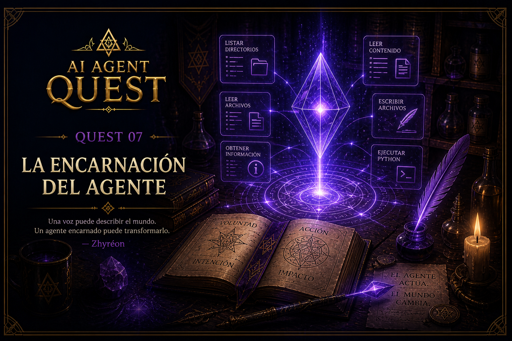

# Quest 07 — La Encarnación del Agente

<p align="center">
    
</p>

> *“La voluntad deja de ser idea cuando encuentra manos.”*  
> — Zhyréon

## Información del Quest

| Dificultad | Tiempo estimado |
|---|---|
| 🔴 Avanzado | 35–50 mins |

---

## Objetivo

Hasta ahora, el agente solo podía:
- conversar
- recibir instrucciones
- describir herramientas
- planear acciones

Pero todavía no podía actuar.

En este Quest construiremos la primera manifestación real del agente sobre el mundo.

Por primera vez:
- el modelo solicitará herramientas
- el programa ejecutará funciones reales
- el agente podrá interactuar con archivos
- el agente podrá producir efectos reales

**El agente se encarna.**

---

## Qué aprenderás

- cómo ejecutar function calls reales
- cómo construir un dispatcher de herramientas
- qué es un `function_map`
- cómo transformar un `FunctionCall` en ejecución real
- cómo devolver resultados estructurados al modelo
- cómo manejar herramientas de forma segura
- cómo inspeccionar resultados usando `verbose mode`

---

## La idea clave

Los modelos NO ejecutan código.

El modelo únicamente:
- decide qué herramienta usar
- genera argumentos
- describe acciones

Tu programa sigue siendo quien:
- ejecuta funciones
- controla permisos
- valida seguridad
- devuelve observaciones

Este Quest construye ese puente.

---

## El flujo completo

Ahora el proceso se ve así:

```text
1. Registramos herramientas
2. El usuario envía un prompt
3. El modelo decide qué tool usar
4. El modelo genera function_calls
5. Nuestro programa ejecuta herramientas reales
6. El programa devuelve resultados estructurados
```

En este Quest llegaremos hasta el paso 6.

Todavía NO construiremos el agent loop completo.

---

## El dispatcher de herramientas

Necesitamos una forma de transformar:

```text
get_files_info(...)
```

en una llamada real de Python.

Para eso construiremos:

```python
function_map = {
    ...
}
```

Ejemplo:

```python
function_map = {
    "get_files_info": get_files_info,
}
```

Esto nos permite:
- buscar funciones por nombre
- ejecutarlas dinámicamente
- mantener control centralizado

---

## call_function()

La pieza principal de este Quest será:

```python
call_function(function_call, verbose=False)
```

Esta función:
- recibe un `FunctionCall`
- identifica qué tool quiere usar el modelo
- ejecuta la función correspondiente
- devuelve el resultado estructurado

---

## Resultados estructurados

Las respuestas de tools deben devolverse usando:

```python
types.Content(...)
```

Ejemplo:

```python
return types.Content(
    role="tool",
    parts=[
        types.Part.from_function_response(
            name=function_name,
            response={"result": function_result},
        )
    ],
)
```

Esto transforma el resultado en una observación estructurada que el sistema puede procesar.

---

## El working_directory sigue protegido

El modelo NO controla:

```python
working_directory
```

Tu programa debe inyectarlo manualmente:

```python
args["working_directory"] = ...
```

Esto sigue siendo un guardrail importante.

---

## Verbose Mode

En este Quest agregaremos:

```bash
--verbose
```

para inspeccionar:
- prompts
- token usage
- tool calls
- resultados de herramientas

Ejemplo:

```bash
uv run python -m quests.quest_07_agent_embodiment.starter.main \
"lee notes.txt" \
--verbose
```

---

## Tu misión

En este Quest trabajarás en cuatro partes.

---

### 1. Completar el dispatcher de herramientas

Abre:

```text
common/functions/call_function.py
```

y completa:

```python
function_map = {
    ...
}
```

registrando:
- `get_files_info`
- `get_file_content`
- `write_file`
- `run_python_file`

---

### 2. Implementar call_function()

Debes completar:

```python
call_function(function_call, verbose=False)
```

La función debe:

- imprimir tool calls
- validar nombres de herramientas
- copiar argumentos
- inyectar `working_directory`
- ejecutar funciones reales
- devolver `types.Content(...)`

---

### 3. Agregar verbose mode

Debes agregar:

```bash
--verbose
```

usando `argparse`.

Cuando esté activo, el programa debe mostrar:
- user prompt
- prompt tokens
- response tokens
- resultados de herramientas

---

### 4. Ejecutar herramientas reales

En:

```text
starter/main.py
```

debes:

- iterar sobre:
  ```python
  response.function_calls
  ```

- ejecutar:
  ```python
  call_function(...)
  ```

- validar:
  - `.parts`
  - `.function_response`
  - `.response`

- almacenar resultados en:
  ```python
  function_results
  ```

---

## Resultado esperado

Prompt:

```text
¿Qué archivos hay en la raíz?
```

Resultado aproximado:

```text
- Calling function: get_files_info
-> {'result': 'Result for current directory: ...'}
```

---

## Importante

En este Quest:
- todavía NO devolveremos resultados al modelo
- todavía NO construiremos loops autónomos
- todavía NO permitiremos múltiples iteraciones

Por ahora solo queremos:
- ejecutar tools reales
- observar resultados
- conectar intención con acción

---

## Referencias del Códex

- `docs/agents/function_calling.md`
- `docs/agents/tool_schemas.md`
- `docs/agents/error_handling.md`
- `docs/agents/guardrails.md`