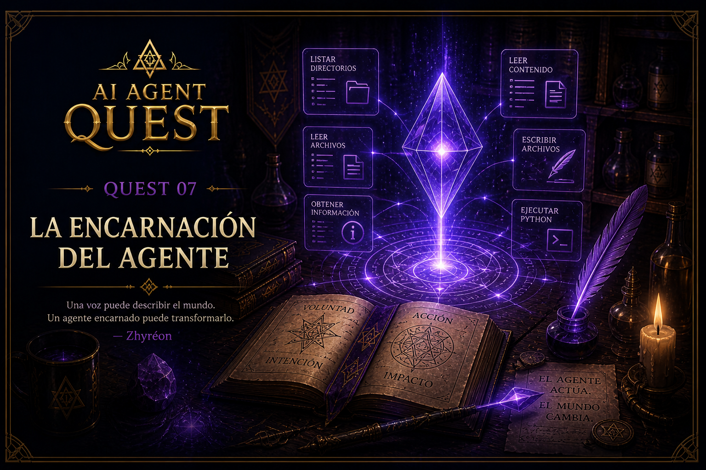

# Quest 07 — La Encarnación del Agente

<p align="center">
    
</p>

## 🎭 Lore

> *“La voluntad deja de ser idea cuando encuentra manos.”*
>
> — Zhyréon

## Información del Quest

| Acto | Dificultad | Tiempo estimado |
|---|---|---|
| II — Capacidad de Acción | 🔴 Avanzado | 35–50 mins |

---

## 🎯 Objetivo

Ejecutar **function calls reales** desde Python: cuando el modelo solicite una herramienta, tu programa la corre, captura el resultado y lo devuelve estructurado como `types.Content`.

Hasta ahora, el agente conversaba, recibía instrucciones, describía herramientas y planeaba acciones — pero no podía actuar. En este Quest construyes la primera manifestación real del agente sobre el mundo: el modelo solicita herramientas, tu programa ejecuta funciones reales, el agente produce efectos.

---

## 📚 Conceptos clave

### Qué aprenderás

- cómo ejecutar function calls reales
- cómo construir un dispatcher de herramientas
- qué es un `function_map`
- cómo transformar un `FunctionCall` en ejecución real
- cómo devolver resultados estructurados al modelo
- cómo manejar herramientas de forma segura
- cómo inspeccionar resultados usando `verbose mode`

### La idea clave

Los modelos NO ejecutan código. El modelo únicamente:
- decide qué herramienta usar
- genera argumentos
- describe acciones

Tu programa sigue siendo quien:
- ejecuta funciones
- controla permisos
- valida seguridad
- devuelve observaciones

Este Quest construye ese puente.

### El flujo completo

```text
1. Registramos herramientas
2. El usuario envía un prompt
3. El modelo decide qué tool usar
4. El modelo genera function_calls
5. Nuestro programa ejecuta herramientas reales
6. El programa devuelve resultados estructurados
```

En este Quest llegaremos hasta el paso 6. Todavía **NO** construiremos el agent loop completo.

### El dispatcher de herramientas

Necesitamos una forma de transformar:

```text
get_files_info(...)
```

en una llamada real de Python. Para eso construiremos:

```python
function_map = {
    "get_files_info": get_files_info,
}
```

Esto permite buscar funciones por nombre, ejecutarlas dinámicamente y mantener control centralizado.

### `call_function()`

La pieza principal de este Quest será:

```python
call_function(function_call, verbose=False)
```

Esta función:
- recibe un `FunctionCall`
- identifica qué tool quiere usar el modelo
- ejecuta la función correspondiente
- devuelve el resultado estructurado

### Resultados estructurados

Las respuestas de tools deben devolverse usando `types.Content`:

```python
return types.Content(
    role="tool",
    parts=[
        types.Part.from_function_response(
            name=function_name,
            response={"result": function_result},
        )
    ],
)
```

Esto transforma el resultado en una observación estructurada que el sistema puede procesar.

**Recomendamos leer la [entrada del códice](../../docs/agents/function_dispatch.md) antes de proceder con este laboratorio.**

### El `working_directory` sigue protegido

El modelo NO controla `working_directory`. Tu programa debe inyectarlo manualmente:

```python
args["working_directory"] = ...
```

Esto sigue siendo un [guardrail](../../docs/agents/guardrails.md) importante.

### Verbose Mode

En este Quest agregaremos el flag:

```bash
--verbose
```

para inspeccionar prompts, token usage, tool calls y resultados de herramientas.

Con `arkanum start 7 "..."` ese flag controla **cuánto detalle ves en la terminal**:

- **sin `--verbose`** — vista limpia: la tool con sus args resumidos y un resumen del resultado (`↳ ok (…)`),
- **con `--verbose`** — además los tokens, los argumentos completos y el resultado completo de cada tool.

El dashboard `/live-agent` recibe el detalle completo en ambos casos (lo filtra su propio toggle **🔍 Verbose**).

Ejemplo:

```bash
arkanum start 7 "lee notes.txt" --verbose
```

(equivalente legacy: `uv run python -m quests.quest_07_agent_incarnation.starter.main "lee notes.txt" --verbose`)

---

## 📋 Tu misión

En este Quest trabajarás en cuatro partes.

### 1. Completar el dispatcher de herramientas

Abre `common/functions/call_function.py` y completa:

```python
function_map = {
    ...
}
```

registrando:
- `get_files_info`
- `get_file_content`
- `write_file`
- `run_python_file`

### 2. Implementar `call_function()`

Debes completar:

```python
call_function(function_call, verbose=False)
```

La función debe:

- imprimir tool calls
- validar nombres de herramientas
- copiar argumentos
- inyectar `working_directory`
- ejecutar funciones reales
- devolver `types.Content(...)`

### 3. Agregar verbose mode

Debes agregar:

```bash
--verbose
```

usando `argparse`. Cuando esté activo, el programa debe mostrar:
- user prompt
- prompt tokens
- response tokens
- resultados de herramientas

Si no estás familiarizado con `verbose`, lee [esta entrada del Códice](../../docs/terminal/verbose_mode.md).

### 4. Ejecutar herramientas reales

En `starter/main.py` debes:

- iterar sobre `response.function_calls`
- ejecutar `call_function(...)`
- validar:
  - `.parts`
  - `.function_response`
  - `.response`
- almacenar resultados en `function_results`

**Recomendamos leer [esta entrada sobre Content y Parts](../../docs/agents/content_and_parts.md) para entender mejor cómo funciona.**

---

## ⚠️ Importante

En este Quest:
- todavía **NO** devolveremos resultados al modelo
- todavía **NO** construiremos loops autónomos
- todavía **NO** permitiremos múltiples iteraciones

Por ahora solo queremos:
- ejecutar tools reales
- observar resultados
- conectar intención con acción

---

## 🧭 Dos comandos, dos propósitos

A partir de Q07 vale la pena entender bien cuándo usar cada uno:

| Comando | Para qué | Toca Live Agent |
|---|---|---|
| `arkanum start 7 "..."` | Correr tu solución + ver al agente paso a paso en el dashboard | **Sí** (automático) |
| `arkanum check 7` | Validar y sellar la quest | No |

Ambos consumen cuota de Gemini. En Q07 `start` **traza solo**: cada corrida aparece en el visualizador sin que tengas que recordar ningún flag. `check` es lo que te da el rango y el XP, pero no alimenta el panel.

## 🪞 Ver al agente en vivo

Para ver paso a paso cómo el modelo decide qué tool usar, asegúrate de tener el dashboard arrancado:

```bash
arkanum dashboard start
```

Luego ejecuta el agente con `start` (en Q07 el tracing es automático):

```bash
arkanum start 7 "lee notes.txt y resume su contenido"
```

Abre [http://127.0.0.1:8765/live-agent](http://127.0.0.1:8765/live-agent) en el navegador. El panel muestra cada `function_call` con su argumento y el resultado de cada tool — sin que tengas que leer el output en la terminal. Activa el toggle **🔍 Verbose** del panel para añadir los tokens, la latencia y el razonamiento del modelo.

> ℹ️ `arkanum check 7` **no** alimenta `/live-agent`. Si terminas la quest y el panel está vacío, eso es esperado: corre `arkanum start 7 "..."` para verlo.

---

## ✅ Resultado esperado

Prompt:

```text
¿Qué archivos hay en la raíz?
```

El agente solicita la herramienta `get_files_info` y devuelve el listado. Con `arkanum start 7` lo verás formateado:

- **sin `--verbose`** (vista limpia): `🛠 get_files_info(directory=".")` con `↳ ok (…)`, más la respuesta final `🤖 Agente: …`.
- **con `--verbose`**: además los args completos, los tokens y el resultado completo de la tool.

Si corres el starter directo (legacy `uv run python -m …`), verás el stdout sin formatear:

```text
Calling function: get_files_info({'directory': '.'})
-> {'result': 'Result for current directory:\n- notes.txt: file_size=77, is_dir=False\n- ...'}
```

---

## 🔗 Referencias

- [Function dispatch — entrada del códice](../../docs/agents/function_dispatch.md)
- [Content y Parts](../../docs/agents/content_and_parts.md)
- [Guardrails](../../docs/agents/guardrails.md)
- [Verbose mode](../../docs/terminal/verbose_mode.md)
