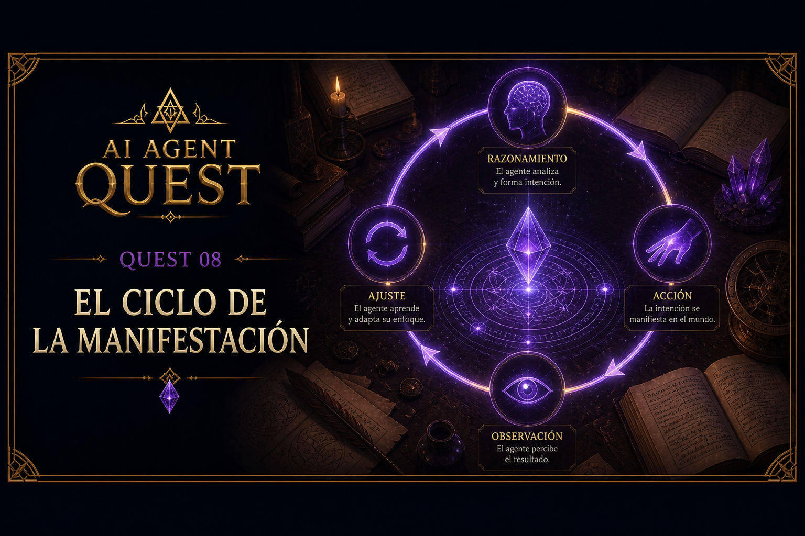

# Quest 08 — El Ciclo de la Manifestación

<p align="center">
    
</p>

> *“Una acción aislada puede ser accidente.  
> La voluntad persistente transforma el mundo.”*  
> — Zhyréon

## Información del Quest

| Dificultad | Tiempo estimado |
|---|---|
| 🔴 Avanzado | 40–60 mins |

---

## Objetivo

Hasta ahora, nuestro agente podía:
- conversar
- elegir herramientas
- ejecutar funciones reales

Pero todavía tenía una limitación importante:

> solo podía actuar una vez.

En este Quest construiremos el primer ciclo autónomo del agente.

Por primera vez, el agente podrá:
- observar resultados
- reaccionar a observaciones
- continuar iterando
- perseguir un objetivo durante múltiples pasos

El agente entra en el ciclo de la manifestación.

---

## Qué aprenderás

- qué es un agent loop
- cómo mantener historial conversacional
- cómo construir ciclos iterativos
- cómo devolver observaciones al modelo
- cómo manejar múltiples tool calls
- cómo controlar loops infinitos
- cómo separar:
  - razonamiento
  - ejecución
  - observación

---

## La idea clave

Los agentes modernos no funcionan como:

```text
pregunta → respuesta
```

Funcionan más parecido a:

```text
objetivo
→ razonamiento
→ acción
→ observación
→ ajuste
→ nueva acción
```

Ese ciclo iterativo es el corazón de los sistemas agénticos.

---

## El flujo completo

En este Quest construiremos:

```text
usuario
→ modelo
→ tool calls
→ ejecución
→ observaciones
→ modelo
→ nuevas acciones
→ respuesta final
```

Por primera vez:
- el modelo verá resultados de herramientas
- podrá reaccionar a ellos
- podrá continuar trabajando

---

## El agent loop

El loop principal utilizará:

```python
for _ in range(MAX_ITERS):
```

Esto permite:
- limitar iteraciones
- evitar loops infinitos
- mantener control del agente

---

## ¿Por qué MAX_ITERS?

Los agentes pueden:
- atascarse
- repetir acciones
- alucinar
- caer en loops

Por eso necesitamos límites explícitos.

El laboratorio ya incluye:

```python
MAX_ITERS
```

en:

```text
common/config.py
```

---

## Refactorizando generate_content()

Hasta ahora, toda la lógica estaba mezclada dentro de `main.py`.

En este Quest separaremos:

```python
generate_content(messages, verbose)
```

Esto hará mucho más fácil:
- iterar
- mantener historial
- reutilizar lógica
- construir loops agentic

---

## Historial conversacional

El agente necesita recordar:
- prompts
- respuestas
- tool calls
- observaciones

Por eso trabajaremos sobre:

```python
messages = [...]
```

Cada iteración agregará:
- respuestas del modelo
- resultados de herramientas

---

## Tool responses

Después de ejecutar una tool:

```python
call_function(...)
```

debemos devolver el resultado al modelo usando:

```python
types.Content(
    role="tool",
    parts=function_results,
)
```

Esto permite que el modelo:
- vea observaciones
- interprete resultados
- continúe razonando

---

## ¿Qué rompe el loop?

El loop termina cuando:

```python
response.text
```

contiene una respuesta final del modelo.

Si el modelo todavía quiere usar herramientas:
- el loop continúa

Si el modelo responde normalmente:
- el ciclo termina

---

## Tu misión

En este Quest trabajarás en cinco partes.

---

### 1. Refactorizar generate_content()

Debes mover la lógica principal de generación a:

```python
generate_content(messages, verbose)
```

Esta función será responsable de:
- llamar Gemini
- manejar tools
- ejecutar function calls
- agregar observaciones
- devolver respuesta final

---

### 2. Construir el agent loop

Debes crear:

```python
for _ in range(MAX_ITERS):
```

El loop debe:
- ejecutar `generate_content(...)`
- detenerse cuando exista respuesta final
- continuar cuando existan tools pendientes

---

### 3. Agregar historial conversacional

Debes mantener:

```python
messages = [...]
```

actualizado en cada iteración.

El historial debe incluir:
- prompts del usuario
- respuestas del modelo
- resultados de herramientas

---

### 4. Manejar tool responses

Después de ejecutar tools:
- valida `.parts`
- valida `.function_response`
- valida `.response`

Luego agrega:

```python
types.Content(
    role="tool",
    parts=function_results,
)
```

al historial.

---

### 5. Manejar errores y límites

Debes:
- capturar errores de ejecución
- manejar iteraciones máximas
- lanzar errores si no existe `response.text`
- evitar loops infinitos

---

## Resultado esperado

Prompt:

```text
Lee notes.txt y luego dime qué contiene.
```

Resultado aproximado:

```text
- Calling function: get_file_content
-> {'result': 'Hello apprentice...'}

Final response:
El archivo contiene...
```

---

## Importante

En este Quest:
- el agente todavía NO tiene memoria persistente
- todavía NO tiene planificación compleja
- todavía NO tiene sub-agentes
- todavía NO tiene razonamiento explícito

Pero sí tiene:

```text
acción → observación → iteración
```

Y eso cambia todo.