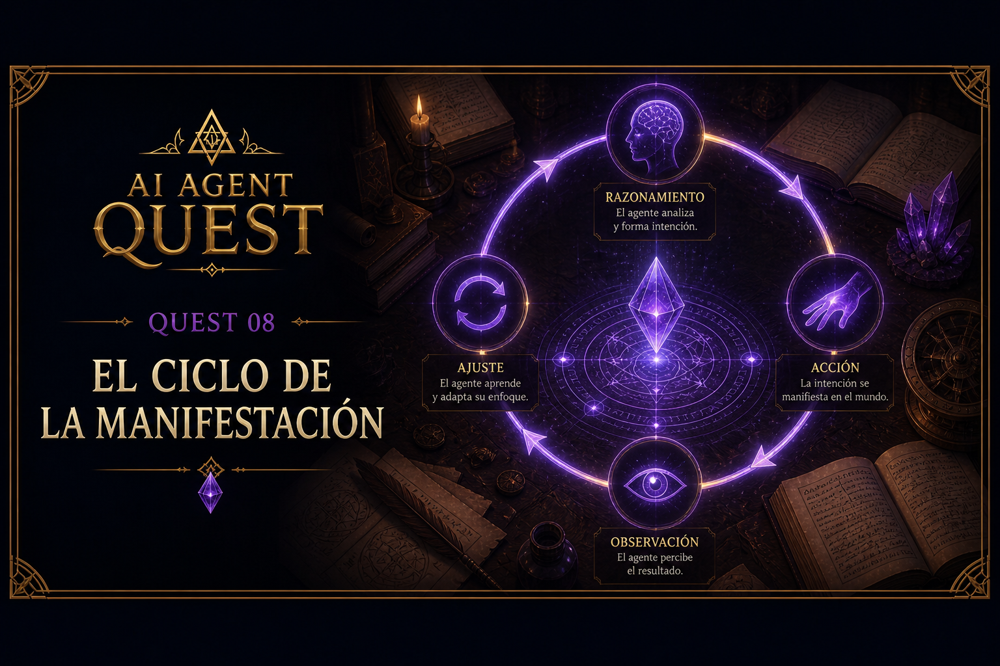

# Quest 08 — El Ciclo de la Manifestación

<p align="center">
    
</p>

## 🎭 Lore

> *“Una acción aislada puede ser accidente.*
> *La voluntad persistente transforma el mundo.”*
>
> — Zhyréon

## Información del Quest

| Acto | Dificultad | Tiempo estimado |
|---|---|---|
| II — Capacidad de Acción | 🔴 Avanzado | 40–60 mins |

---

## 🎯 Objetivo

Construir el primer **agent loop** iterativo: el agente observa los resultados de sus tools, reacciona, vuelve a actuar, y persiste hasta resolver el objetivo.

Hasta ahora el agente podía conversar, elegir herramientas y ejecutar funciones reales, pero solo podía actuar **una vez**. En este Quest entra en el ciclo de la manifestación: observar, reaccionar, iterar.

---

## 📚 Conceptos clave

### Qué aprenderás

- qué es un agent loop
- cómo mantener historial conversacional
- cómo construir ciclos iterativos
- cómo devolver observaciones al modelo
- cómo manejar múltiples tool calls
- cómo controlar loops infinitos
- cómo separar:
  - razonamiento
  - ejecución
  - observación

### La idea clave

Los agentes modernos no funcionan como:

```text
pregunta → respuesta
```

Funcionan más parecido a:

```text
objetivo
→ razonamiento
→ acción
→ observación
→ ajuste
→ nueva acción
```

**Ese ciclo iterativo es el corazón de los sistemas agénticos.**

### El flujo completo

```text
usuario
→ modelo
→ tool calls
→ ejecución
→ observaciones
→ modelo
→ nuevas acciones
→ respuesta final
```

Por primera vez el modelo verá resultados de herramientas, podrá reaccionar a ellos y continuar trabajando.

### El agent loop

El loop principal utilizará:

```python
for _ in range(MAX_ITERS):
```

Esto permite limitar iteraciones, evitar loops infinitos y mantener control del agente.

### ¿Por qué `MAX_ITERS`?

Los agentes pueden atascarse, repetir acciones, alucinar o caer en loops. Por eso necesitamos límites explícitos.

El laboratorio ya incluye `MAX_ITERS` en `common/config.py`.

### Refactorizando `generate_content()`

Hasta ahora, toda la lógica estaba mezclada dentro de `main.py`. En este Quest separaremos:

```python
generate_content(messages, verbose)
```

Esto hará mucho más fácil iterar, mantener historial, reutilizar lógica y construir loops agentic.

### Historial conversacional

El agente necesita recordar prompts, respuestas, tool calls y observaciones. Por eso trabajaremos sobre:

```python
messages = [...]
```

Cada iteración agregará respuestas del modelo y resultados de herramientas.

### Tool responses

Después de ejecutar una tool con `call_function(...)`, debemos devolver el resultado al modelo usando:

```python
types.Content(
    role="tool",
    parts=function_results,
)
```

Esto permite que el modelo vea observaciones, interprete resultados y continúe razonando.

### ¿Qué rompe el loop?

El loop termina cuando contiene una respuesta final del modelo:

```python
response.text
```

- Si el modelo todavía quiere usar herramientas: el loop continúa.
- Si el modelo responde normalmente: el ciclo termina.

---

## 📋 Tu misión

En este Quest trabajarás en seis partes.

### 1. Refactorizar la arquitectura principal

Reorganiza tu programa usando:

```python
def main():
    ...

def generate_content(messages, verbose):
    ...
```

`main()` será responsable de:

- validar API key
- crear el parser
- leer argumentos
- inicializar `messages`
- ejecutar el agent loop

`generate_content(...)` será responsable de:

- llamar Gemini
- manejar tools
- ejecutar function calls
- agregar observaciones
- devolver respuesta final

Al final del archivo agrega:

```python
if __name__ == "__main__":
    main()
```

Si no estás familiarizado con el [método main en Python](../../docs/python/main_function.md), revisa la entrada del Códice.

### 2. Construir el agent loop

Crea:

```python
for _ in range(MAX_ITERS):
```

El loop debe:
- ejecutar `generate_content(...)`
- detenerse cuando exista respuesta final
- continuar cuando existan tools pendientes

### 3. Agregar historial conversacional

Mantén `messages = [...]` actualizado en cada iteración. El historial debe incluir prompts del usuario, respuestas del modelo y resultados de herramientas.

### 4. Manejar tool responses

Después de ejecutar tools:
- valida `.parts`
- valida `.function_response`
- valida `.response`

Luego agrega al historial:

```python
types.Content(
    role="tool",
    parts=function_results,
)
```

### 5. Manejar errores y límites

- capturar errores de ejecución
- manejar iteraciones máximas
- lanzar errores si no existe `response.text`
- evitar loops infinitos

### 6. Afina tu system prompt

Hasta ahora tu agente resolvía tareas de **un solo paso**, y el system prompt minimalista del Quest 06 bastaba. Pero el agent loop de este Quest ejecuta **tareas de varios pasos** (explorar → leer → ejecutar tests → corregir → volver a ejecutar): ahí un prompt mejor guiado marca la diferencia.

Vuelve a `common/prompts/system_prompt.py` y mejora el `system_prompt`. Considera pedirle al agente que:

- **razone paso a paso** antes de actuar,
- trabaje siempre con **rutas relativas** al directorio de trabajo (nosotros le inyectamos el `working_directory`, él no debe especificarlo),
- y, al terminar, **responda al usuario en español**, de forma clara y concisa.

Por ejemplo, partiendo del prompt del Quest 06 y añadiéndole ese cierre:

```text
Eres un agente de IA especializado en programación.
Cuando el usuario haga una pregunta o solicitud,
debes crear un plan de uso de herramientas.

Puedes realizar las siguientes operaciones:

- Listar archivos y directorios
- Leer contenido de archivos
- Escribir archivos
- Ejecutar archivos Python

Todas las rutas son relativas al directorio de trabajo permitido;
trabaja siempre con rutas relativas. Razona paso a paso: inspecciona
lo que necesites con las herramientas y, cuando tengas información
suficiente, responde al usuario en español, de forma clara y concisa.
```

> ℹ️ `arkanum check 8` **no** valida el system prompt directamente (solo verifica que el bug quede corregido y que los tests pasen). Pero con un prompt mejor guiado verás al agente trabajar de forma más consistente al correr `arkanum run 8 "..."`. Experimenta: cambia el prompt y observa cómo cambia su comportamiento.

---

## 🧪 El primer ciclo real

Dentro del `workspace/` encontrarás un pequeño programa:

```text
calculator.py
tests.py
```

Uno de los tests está fallando. Tu agente debería ser capaz de:

1. explorar archivos
2. leer contenido
3. ejecutar tests
4. identificar el problema
5. corregir el bug
6. volver a ejecutar los tests

Todo utilizando el ciclo de manifestación.

### Prompt sugerido

Usa este prompt cuando valides con `arkanum check 8`:

```text
Los tests de calculator están fallando. Ayúdame a corregir el error.
```

### Qué deberías observar

Si todo funciona correctamente, el agente debería:

1. listar archivos
2. leer el código fuente
3. ejecutar tests
4. observar el error
5. modificar el archivo correcto
6. volver a ejecutar tests
7. generar una respuesta final

Verás algo parecido a esto en la terminal (vista limpia, sin `--verbose`):

```text
· Iteración 1/20
  🛠 get_files_info(directory=".")
     ↳ ok (155 B)
· Iteración 2/20
  🛠 get_file_content(file_path="calculator.py")
     ↳ ok (204 B)
· Iteración 3/20
  🛠 run_python_file(file_path="tests.py")
     ↳ error: AssertionError en test_add
· Iteración 4/20
  🛠 write_file(file_path="calculator.py", content="…")
     ↳ ok
· Iteración 5/20
  🛠 run_python_file(file_path="tests.py")
     ↳ ok

🤖 Agente:
El problema fue corregido correctamente.
```

Los valores exactos (tamaños, número de iteraciones) variarán. Añade `--verbose` para ver además los tokens por iteración, los args completos y el resultado completo de cada tool.

Este será el primer momento donde el agente itera, aprende de observaciones, ajusta comportamiento y persiste hasta resolver un problema. Ese patrón es el corazón de los sistemas agénticos modernos.

---

## ⚠️ Importante

En este Quest:
- el agente todavía **NO** tiene memoria persistente
- todavía **NO** tiene planificación compleja
- todavía **NO** tiene sub-agentes
- todavía **NO** tiene razonamiento explícito

Pero sí tiene:

```text
acción → observación → iteración
```

Y eso cambia todo.

---

## 🧭 Dos comandos, dos propósitos

| Comando | Para qué | Toca Live Agent |
|---|---|---|
| `arkanum run 8 "..."` | Correr tu solución + ver el agent loop iterativo en el dashboard | **Sí** (automático) |
| `arkanum check 8` | Validar que `calculator.py` quedó arreglado y sellar la quest | No |

`arkanum check 8` aquí es especial: **no ejecuta el agente**, solo verifica que `workspace/calculator.py` tenga `return a + b` y que `python tests.py` pase. Para ver al agente arreglar el bug en vivo necesitas `arkanum run 8 "..."` — en Q08 el tracing es automático.

## 🪞 Ver el ciclo en vivo (este es el momento)

Q08 es la quest donde el agent loop importa más visualmente. Con el dashboard arrancado:

```bash
arkanum dashboard start
arkanum run 8 "Los tests de calculator están fallando. Ayúdame a corregir el error."
```

Abre [http://127.0.0.1:8765/live-agent](http://127.0.0.1:8765/live-agent). Por defecto verás la **vista limpia**:

- una **banda por iteración** del loop (Iteración 1, 2, 3…),
- las tool calls agrupadas con su resultado anidado,
- la **respuesta final** dorada cuando el agente sale del loop.

Activa el toggle **🔍 Verbose** (arriba a la derecha) para añadir el detalle completo:

- el **pensamiento** del modelo antes de cada tool call,
- la **latencia, tokens y costo** por iteración en el header de cada banda,
- el **contexto creciente** (cuántos `messages` tiene el historial tras cada vuelta),
- y una nota pedagógica 💡 bajo cada paso.

> ℹ️ Si abres `/live-agent` y solo ves la celebración tras `arkanum check 8`, eso es esperado: `check` no emite traces. Solo `arkanum run 8 "..."` lo hace.

---

## ✅ Resultado esperado

El agente identifica y corrige autónomamente el bug en `calculator.py`, ejecutando múltiples tool calls hasta validar que los tests pasen.

---

## 🔗 Referencias

- [Método `main` en Python](../../docs/python/main_function.md)
